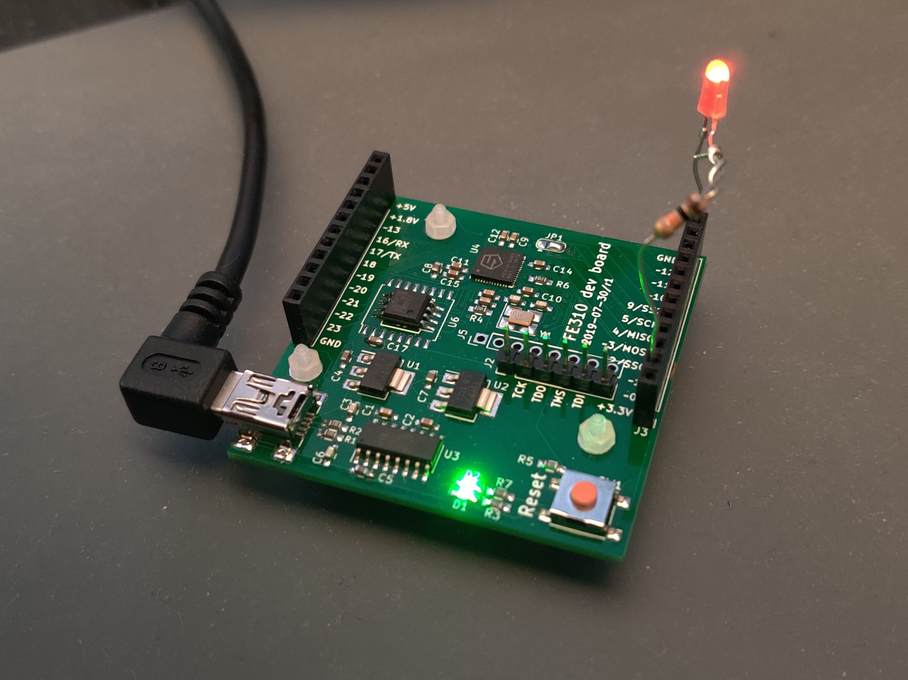

# fe310-dev

A development board for the SiFive [FE310 chip](https://www.sifive.com/chip-designer#fe310), a RISC-V microcontroller. Compatible with both the FE310-G000 and FE310-G002.

## Revisions
* Revision 0 - initial revision
	* [revision 0 schematic](./mfg/rev0/fe310-dev.pdf), [revision 0 gerbers](./mfg/rev0)
* Revision 1 - added support for the G002, added mounting holes, fixed silkscreen labels for pins and LEDs
	* [revision 1 schematic](./mfg/rev1/fe310-dev.pdf), [revision 1 gerbers](./mfg/rev1)

## Pinouts
The main pins are on the sides, and are labeled on the silkscreen. PWM capable pins are labeled with a ~, and pins with support for the SPI or UART peripherals have their functions labeled.

In the middle of the board, there are two sets of pins. The first is the JTAG header, which is partially labeled. When holding the board upright (so the "FE310 dev board" text can be read, and the USB port faces upwards), the pins are as follows:

* +3.3V
* TCK
* TDO
* TMS
* TDI
* GND

Most of these should go directly to the matching pin on your JTAG adapter. The one exception is +3.3V. If you want to power the board from your adapter, connect +3.3V to your adapter's power; however, if you want to power the board from USB (so that you can see the serial port), then leave the JTAG header's +3.3V pin disconnected.

The second set of pins has no labels. When holding the board upright, the pins are as follows:

* +1.8V
* AON_PMU_OUT_0
* AON_PMU_OUT_1
* AON_PMU_DWAKEUP_N
* AON_ERST_N
* AON_PSD_LFALTCLK
* AON_PSD_LFALTSEL
* GND

These are part of the Always-On (AON) Block of the FE310. You can check the FE310 manual for more information about these pins; however, in most cases, the only relevant pin is AON_ERST_N, which resets the chip (and is connected to the Reset button on the board). **Note that just because there's a +1.8V pin does _not_ mean the AON pins operate at 1.8V. See [issue #7](https://github.com/thatoddmailbox/fe310-dev/issues/7) for details.**

## Known issues
You can see the [known issues for revision 0](https://github.com/thatoddmailbox/fe310-dev/issues?q=is%3Aissue+label%3A%22affects+rev+0%22+) and [known issues for revision 1](https://github.com/thatoddmailbox/fe310-dev/issues?q=is%3Aissue+label%3A%22affects+rev+1%22+).

## Helpful links
* [Forked freedom-e-sdk](https://github.com/thatoddmailbox/freedom-e-sdk)
* [Revision 1 Schematic](./mfg/rev1/fe310-dev.pdf)
* [FE310-G002 Datasheet v1p0](https://sifive.cdn.prismic.io/sifive%2F3d777659-a0dd-49ed-a011-5bebba17aecf_fe310-g002-ds.pdf)
* [FE310-G002 Manual v19p04](https://sifive.cdn.prismic.io/sifive%2F9ecbb623-7c7f-4acc-966f-9bb10ecdb62e_fe310-g002.pdf)